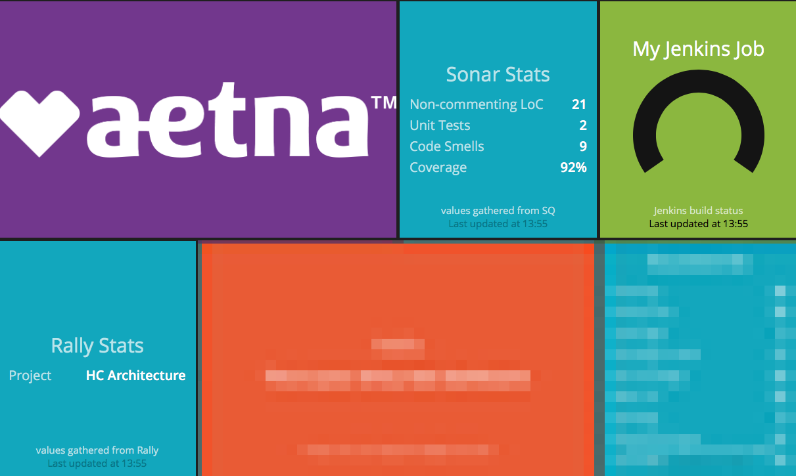

# dockerized-dashboard
A dockerized dashboard (using the Smashing dashboard framework) for developing dashboard components locally.

# How to build and run a local dashboard
1. Install docker locally.
1. From the root of this repo, run `docker build -t dashboard .`. This will build the docker container.
1. To start the dashboard, run `docker run -d -p 8080:3030 dashboard`. The dashboard is now available in your web browser via http://localhost:8080.

# How to get the SonarQube widget working
1. The widget queries a local SonarQube service running on port 9000. Therefore, run `docker run -d --name sonarqube -p 9000:9000 sonarqube` in order to stand up that service. SonarQube is now available in your web browser at http://localhost:9000. Login to the SonarQube using the default username/password combination of admin/admin.
1. The dashboard still needs to know the network address for this SonarQube instance. Run `docker network inspect bridge`, find the container named sonarqube and note its IPv4Address.
1. Edit jobs/sonar.rb and change the value for bridge_network_sq_ip to the IPv4Address value from the previous step.
1. Rebuild and re-run the dashboard container. The widget's background should eventually change to the default widget background, currently a solid (no flashing) light blue. This indicates a healthy connection to SonarQube. Unhealthy connections will change the background to use the style `status-warning` or `status-danger` as defined in the default CSS. These styles usually include "alarming" colors like red and yellow, and include a flashing behavior to grab the user's attention.

# How to get the SonarQube widget to actually display something useful for a Gradle project
1. If you don't have Gradle installed locally, install it. Basic guidance is available at https://spring.io/guides/gs/gradle/#initial.
1. If you don't have a Gradle project, grab one via `git clone https://github.com/spring-guides/gs-gradle.git` and then `cd gs-gradle/complete` directory within the repo. (h/t to https://spring.io/guides/gs/gradle/ for basic guidance).
1. Login to SonarQube, go to My Account, then the Security tab. Generate a token and note the value for the next step.
1. Create/edit `~/.gradle/gradle.properties` with your favorite editor,
ensuring the following is present (be sure to insert your token from previous step in place of ``<YOUR_TOKEN_HERE>``):

        systemProp.sonar.host.url=http://localhost:9000

        #----- Token generated from an account with 'publish analysis' permission
        systemProp.sonar.login=<YOUR_TOKEN_HERE>
1. In your project root, edit `build.gradle` to include the following at the top of the file:

        plugins {
            id "org.sonarqube" version "2.7"
        }

        apply plugin: 'jacoco'

1. Run `gradle test jacocoTestReport`. This creates a test coverage report which will be fed to SonarQube in the next step.
1. Run `gradle sonarqube`. It will analyze your code with the SonarQube Scanner for Gradle (https://docs.sonarqube.org/display/SCAN/Analyzing+with+SonarQube+Scanner+for+Gradle) and send results to SonarQube.
1. In SonarQube, confirm a new project has been created to analyze the Gradle project. Browse to the project and then to the Administration tab. Select Update Key and copy the key. Back in the dashboard code, edit `jobs/sonar.rb` and replace the value of `sq_project_key` with the project key from SonarQube.
1. Rebuild and re-run the dashboard container. The widget should now display more useful information about the Gradle project.

# Reference
* Smashing: https://smashing.github.io
* SonarQube latest documentation: https://docs.sonarqube.org/latest/
* JaCoCo basic tutorial: https://www.ratanparai.com/java/java-application-using-gradle-with-code-coverage/
