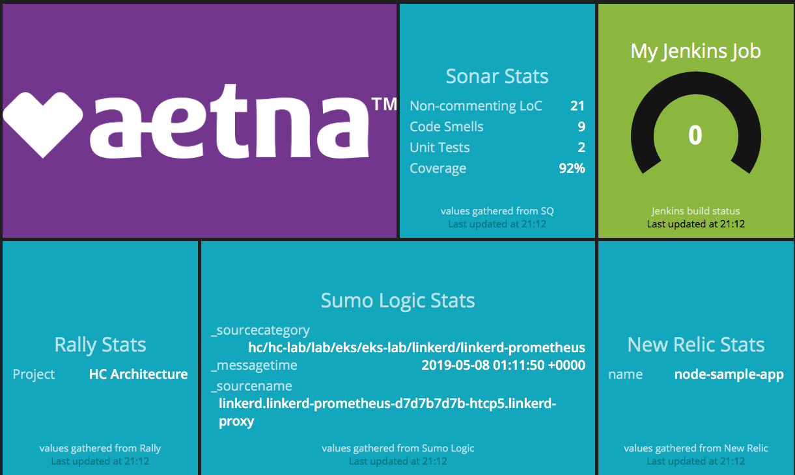

# dockerized-dashboard
This repository contains code for a dockerized dashboard (using the Smashing dashboard framework) for developing dashboard components locally.

Currently, the dashboard contains sample widgets to display information from SonarQube and Rally.

# How to build and run a local dashboard
1. Install docker locally.
1. From the root of this repo, run `docker build -t dashboard .`. This will build the docker container.
1. To start the dashboard, run `docker run -d -p 8080:3030 dashboard`. The dashboard is now available in your web browser via http://localhost:8080.

# How to get the SonarQube widget working
1. The widget queries a local SonarQube service running on port 9000. Therefore, run `docker run -d --name sonarqube -p 9000:9000 sonarqube` in order to stand up that service. SonarQube is now available in your web browser at http://localhost:9000. You may login to the SonarQube using the default username/password combination of admin/admin, but it is not required to connect the dashboard to SonarQube.

   The widget's background should eventually change to the default widget background, currently a solid (no flashing) light blue. This indicates a healthy connection to SonarQube. Unhealthy connections will change the background to use the style `status-warning` or `status-danger` as defined in the default CSS. These styles usually include "alarming" colors like red and yellow, and include a flashing behavior to grab the user's attention.

   If, after a few minutes, the widget's background does not change, continue to the next step.
1. The dashboard still needs to know the network address for this SonarQube instance. Run `docker network inspect bridge`, find the container named sonarqube and note its IPv4Address.
1. Edit `smashing/jobs/sonar.rb` and change the value for bridge_network_sq_ip to the IPv4Address value from the previous step.
1. Rebuild and re-run the dashboard container. The Sonar widget should display with the default background.

# How to get the SonarQube widget to actually display something useful for a Gradle project
1. If you don't have Gradle installed locally, install it. Basic guidance is available at https://spring.io/guides/gs/gradle/#initial.
1. If you don't have a Gradle project already:
  1. Fork a simple one at https://github.com/spring-guides/gs-gradle.git .
  1. Clone it locally via something like `git clone https://github.com/spring-guides/gs-gradle.git`.
  1. `cd gs-gradle/complete` directory within the repo to use the project located in that directory. (h/t to https://spring.io/guides/gs/gradle/ for basic guidance).
1. In your project, edit `build.gradle` to include the following at the top of the file:

        plugins {
            id "org.sonarqube" version "2.7"
        }

        apply plugin: 'jacoco'

1. Run `gradle test jacocoTestReport sonarqube --no-daemon`. This creates a test coverage report and feeds it to SonarQube using the SonarQube Scanner for Gradle (https://docs.sonarqube.org/display/SCAN/Analyzing+with+SonarQube+Scanner+for+Gradle).
1. In SonarQube, confirm a new project has been created to analyze the Gradle project. Browse to the project and then to the Administration tab. Select Update Key and copy the key. Back in the dashboard code, edit `smashing/jobs/sonar.rb` and replace the value of `sq_project_key` with the project key from SonarQube.
1. Rebuild and re-run the dashboard container. The widget should now display useful information about the Gradle project.

# How to get the Rally widget working
1. Copy `smashing/widgets/rally/rally.credentials.template` to `smashing/widgets/rally/rally.credentials` and change the username and password in that file to use valid Rally credentials.
1. Edit jobs/rally.rb and replace the value of `rally_project_key` with the project key from Rally. The project key can be found in the URL for the project homepage, i.e. https://rally1.rallydev.com/#/THIS_IS_MY_PROJECT_KEY.
1. Rebuild and re-run the dashboard container. The widget's background should eventually change to the default widget background, currently a solid (no flashing) light blue. This indicates a healthy connection to Rally. Unhealthy connections will change the background to use the style `status-warning` or `status-danger` as defined in the default CSS. These styles usually include "alarming" colors like red and yellow, and include a flashing behavior to grab the user's attention.

# Reference
* Smashing: https://smashing.github.io
* SonarQube latest documentation: https://docs.sonarqube.org/latest/
* JaCoCo basic tutorial: https://www.ratanparai.com/java/java-application-using-gradle-with-code-coverage/
* Rally Web Services API: https://rally1.rallydev.com/slm/doc/webservice/
